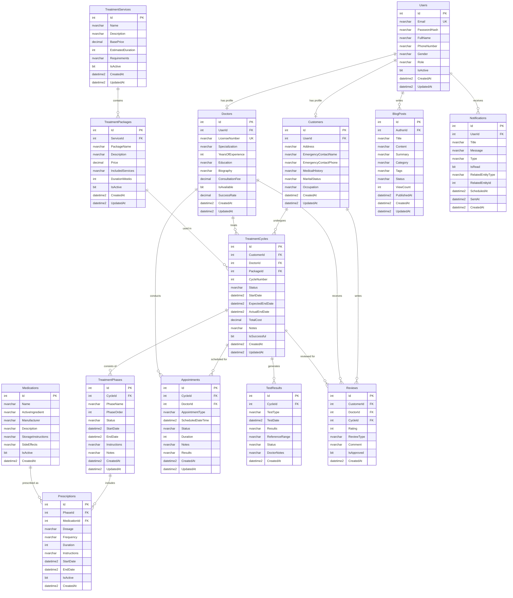

```mermaid
erDiagram
    Users {
        int Id PK
        nvarchar Email UK
        nvarchar PasswordHash
        nvarchar FullName
        nvarchar PhoneNumber
        nvarchar Gender
        nvarchar Role
        bit IsActive
        datetime2 CreatedAt
        datetime2 UpdatedAt
    }

    Customers {
        int Id PK
        int UserId FK
        nvarchar Address
        nvarchar EmergencyContactName
        nvarchar EmergencyContactPhone
        nvarchar MedicalHistory
        nvarchar MaritalStatus
        nvarchar Occupation
        datetime2 CreatedAt
        datetime2 UpdatedAt
    }

    Doctors {
        int Id PK
        int UserId FK
        nvarchar LicenseNumber UK
        nvarchar Specialization
        int YearsOfExperience
        nvarchar Education
        nvarchar Biography
        decimal ConsultationFee
        bit IsAvailable
        decimal SuccessRate
        datetime2 CreatedAt
        datetime2 UpdatedAt
    }

    TreatmentServices {
        int Id PK
        nvarchar Name
        nvarchar Description
        decimal BasePrice
        int EstimatedDuration
        nvarchar Requirements
        bit IsActive
        datetime2 CreatedAt
        datetime2 UpdatedAt
    }

    TreatmentPackages {
        int Id PK
        int ServiceId FK
        nvarchar PackageName
        nvarchar Description
        decimal Price
        nvarchar IncludedServices
        int DurationWeeks
        bit IsActive
        datetime2 CreatedAt
        datetime2 UpdatedAt
    }

    TreatmentCycles {
        int Id PK
        int CustomerId FK
        int DoctorId FK
        int PackageId FK
        int CycleNumber
        nvarchar Status
        datetime2 StartDate
        datetime2 ExpectedEndDate
        datetime2 ActualEndDate
        decimal TotalCost
        nvarchar Notes
        bit IsSuccessful
        datetime2 CreatedAt
        datetime2 UpdatedAt
    }

    TreatmentPhases {
        int Id PK
        int CycleId FK
        nvarchar PhaseName
        int PhaseOrder
        nvarchar Status
        datetime2 StartDate
        datetime2 EndDate
        nvarchar Instructions
        nvarchar Notes
        datetime2 CreatedAt
        datetime2 UpdatedAt
    }

    Medications {
        int Id PK
        nvarchar Name
        nvarchar ActiveIngredient
        nvarchar Manufacturer
        nvarchar Description
        nvarchar StorageInstructions
        nvarchar SideEffects
        bit IsActive
        datetime2 CreatedAt
    }

    Prescriptions {
        int Id PK
        int PhaseId FK
        int MedicationId FK
        nvarchar Dosage
        nvarchar Frequency
        int Duration
        nvarchar Instructions
        datetime2 StartDate
        datetime2 EndDate
        bit IsActive
        datetime2 CreatedAt
    }

    Appointments {
        int Id PK
        int CycleId FK
        int DoctorId FK
        nvarchar AppointmentType
        datetime2 ScheduledDateTime
        nvarchar Status
        int Duration
        nvarchar Notes
        nvarchar Results
        datetime2 CreatedAt
        datetime2 UpdatedAt
    }

    TestResults {
        int Id PK
        int CycleId FK
        nvarchar TestType
        datetime2 TestDate
        nvarchar Results
        nvarchar ReferenceRange
        nvarchar Status
        nvarchar DoctorNotes
        datetime2 CreatedAt
    }

    Reviews {
        int Id PK
        int CustomerId FK
        int DoctorId FK
        int CycleId FK
        int Rating
        nvarchar ReviewType
        nvarchar Comment
        bit IsApproved
        datetime2 CreatedAt
    }

    BlogPosts {
        int Id PK
        int AuthorId FK
        nvarchar Title
        nvarchar Content
        nvarchar Summary
        nvarchar Category
        nvarchar Tags
        nvarchar Status
        int ViewCount
        datetime2 PublishedAt
        datetime2 CreatedAt
        datetime2 UpdatedAt
    }

    Notifications {
        int Id PK
        int UserId FK
        nvarchar Title
        nvarchar Message
        nvarchar Type
        bit IsRead
        nvarchar RelatedEntityType
        int RelatedEntityId
        datetime2 ScheduledAt
        datetime2 SentAt
        datetime2 CreatedAt
    }

    %% Relationships
    Users ||--o| Customers : "has profile"
    Users ||--o| Doctors : "has profile"
    Users ||--o{ BlogPosts : "writes"
    Users ||--o{ Notifications : "receives"

    TreatmentServices ||--o{ TreatmentPackages : "contains"

    Customers ||--o{ TreatmentCycles : "undergoes"
    Doctors ||--o{ TreatmentCycles : "treats"
    TreatmentPackages ||--o{ TreatmentCycles : "used in"

    TreatmentCycles ||--o{ TreatmentPhases : "consists of"
    TreatmentCycles ||--o{ Appointments : "scheduled for"
    TreatmentCycles ||--o{ TestResults : "generates"

    TreatmentPhases ||--o{ Prescriptions : "includes"
    Medications ||--o{ Prescriptions : "prescribed as"

    Customers ||--o{ Reviews : "writes"
    Doctors ||--o{ Reviews : "receives"
    TreatmentCycles ||--o{ Reviews : "reviewed for"

    Doctors ||--o{ Appointments : "conducts"
```
