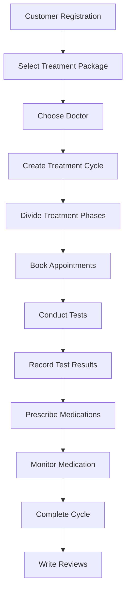

# 🏥 Infertility Treatment System - Main Flow API Documentation

## 📋 Overview

Hệ thống quản lý điều trị vô sinh với main flow từ đăng ký khách hàng đến hoàn thành điều trị và đánh giá.

---

## 🔄 Main Flow Process



---

## 🚀 Flow 1: Customer Registration & Package Selection

### 1.1 Customer Registration

**Endpoint**: `POST /api/auth/register`

**Request Body**:

```json
{
  "email": "phongnqse172516@fpt.edu.vn",
  "password": "string",
  "fullName": "John Doe",
  "phoneNumber": "0901234567",
  "gender": "Male",
  "role": "Customer",
  "address": "123 Đường Lê Lợi, Quận 1, TP. Hồ Chí Minh",
  "emergencyContactName": "Jane Doe",
  "emergencyContactPhone": "0987654321",
  "maritalStatus": "Single",
  "occupation": "Software Engineer"
}
```

**Response**:

```json
{
  "success": true,
  "data": {
    "success": true,
    "message": "Registration successful",
    "userId": 22
  },
  "message": "Registration successful",
  "errors": null,
  "timestamp": "2025-07-10T01:59:27.8812232Z"
}
```

# Login to get token

**Endpoint**: `POST /api/auth/login`

```json
{
  "email": "phongnqse172516@fpt.edu.vn",
  "password": "string"
}
```

**Response**:

```json
{
  "success": true,
  "data": {
    "accessToken": "eyJhbGciOiJIUzI1NiIsInR5cCI6IkpXVCJ9....",
    "refreshToken": "3GnNZ5OAhw+0mRigni5WxkZveEcRft4KRlc8YL9...",
    "user": {
      "id": 22,
      "email": "phongnqse172516@fpt.edu.vn",
      "fullName": "John Doe",
      "phoneNumber": "0901234567",
      "gender": "Male",
      "role": "Customer",
      "createdAt": "2025-07-10T01:59:23.6625789",
      "isActive": true
    },
    "expiresAt": "2025-07-10T03:00:38.8900909Z"
  },
  "message": "Login successful",
  "errors": null,
  "timestamp": "2025-07-10T02:00:38.8901617Z"
}
```

### 1.2 Get Available Treatment Packages

**Endpoint**: `GET /api/treatment-packages`

**Response**:

```json
{
  "success": true,
  "data": [
    {
      "id": 22,
      "serviceId": 12,
      "packageName": "Pakage 1",
      "description": "string",
      "price": 5500,
      "includedServices": "string",
      "durationWeeks": 0
    },
    {
      "id": 23,
      "serviceId": 13,
      "packageName": "Pakage 2",
      "description": "string",
      "price": 5500,
      "includedServices": "string",
      "durationWeeks": 0
    }
  ],
  "message": "Fetched all treatment packages successfully.",
  "errors": null,
  "timestamp": "2025-07-10T02:08:39.5922333Z"
}
```

### 1.3 Get Available Doctors

**Endpoint**: `GET /api/doctors?specialization=IVF`

**Response**:

```json
{
  "success": true,
  "data": {
    "items": [
      {
        "id": 7,
        "userId": 19,
        "fullName": "Doctor 3",
        "specialization": "Urology",
        "isAvailable": false,
        "successRate": 85.7,
        "yearsOfExperience": 10,
        "licenseNumber": "LIC112233"
      }
    ],
    "pageNumber": 1,
    "pageSize": 10,
    "totalCount": 1,
    "totalPages": 1
  },
  "message": "Operation successful",
  "errors": null,
  "timestamp": "2025-07-10T02:10:55.6527362Z"
}
```

---

## 🔄 Flow 2: Create Treatment Cycle & Phases

### 2.1 Create Treatment Cycle

**Endpoint**: `POST /api/treatment-cycles`

**Request Body**:

```json
{
  "customerId": 18,
  "doctorId": 5,
  "packageId": 22,
  "cycleNumber": 1,
  "startDate": "2025-07-10T02:12:13.673Z",
  "totalCost": 0,
  "notes": "Khách hàng có tiền sử vô sinh 3 năm, cần điều trị IVF"
}
```

**Response**:

```json
{
  "success": true,
  "data": {
    "id": 21,
    "createdAt": "2025-07-10T02:13:54.5335136Z",
    "updatedAt": null,
    "isActive": true,
    "customerId": 18,
    "doctorId": 5,
    "packageId": 22,
    "cycleNumber": 1,
    "status": "Created",
    "startDate": "2025-07-10T02:12:13.673Z",
    "expectedEndDate": null,
    "actualEndDate": null,
    "totalCost": 0,
    "notes": "Khách hàng có tiền sử vô sinh 3 năm, cần điều trị IVF",
    "isSuccessful": null,
    "phase": []
  },
  "message": "Treatment cycle created successfully.",
  "errors": null,
  "timestamp": "2025-07-10T02:13:54.584509Z"
}
```

### 2.2 Create Treatment Phases

#### 2.2.1 Create Treatment Phases (tự tạo tay)

**Endpoint**: `POST /api/treatment-phases`

**Request Body**:

```json
{
  "cycleId": 301,
  "phases": [
    {
      "name": "Consultation & Assessment",
      "description": "Khám và đánh giá ban đầu",
      "order": 1,
      "estimatedDuration": 7,
      "requirements": "Xét nghiệm hormone, siêu âm"
    },
    {
      "name": "Ovarian Stimulation",
      "description": "Kích thích buồng trứng",
      "order": 2,
      "estimatedDuration": 14,
      "requirements": "Theo dõi nang trứng, xét nghiệm hormone"
    },
    {
      "name": "Egg Retrieval",
      "description": "Chọc hút trứng",
      "order": 3,
      "estimatedDuration": 1,
      "requirements": "Phẫu thuật nội soi"
    },
    {
      "name": "Embryo Transfer",
      "description": "Chuyển phôi",
      "order": 4,
      "estimatedDuration": 1,
      "requirements": "Chuẩn bị nội mạc tử cung"
    },
    {
      "name": "Pregnancy Monitoring",
      "description": "Theo dõi thai kỳ",
      "order": 5,
      "estimatedDuration": 56,
      "requirements": "Xét nghiệm beta-hCG, siêu âm"
    }
  ]
}
```

**Response**:

```json
{
  "success": true,
  "message": "Treatment phases created successfully",
  "data": [
    {
      "id": 401,
      "cycleId": 301,
      "name": "Consultation & Assessment",
      "description": "Khám và đánh giá ban đầu",
      "order": 1,
      "status": "Active",
      "startDate": "2025-01-15",
      "estimatedEndDate": "2025-01-22",
      "estimatedDuration": 7
    }
    // ... other phases
  ]
}
```

#### 2.2.2 Create Treatment Phases (tạo tự động)

**Endpoint**: `POST /api/treatment-cycles/{id}/initialize`

**Request Body**:

```json
{
  "startDate": "2025-07-10T02:16:45.681Z",
  "treatmentPlan": "Bắt đầu chu kỳ IUI với thuốc kích thích rụng trứng",
  "specialInstructions": "Bệnh nhân cần nghỉ ngơi và uống thuốc theo chỉ định mỗi sáng",
  "estimatedCompletionDate": "2025-08-10T02:16:45.681Z",
  "treatmentType": "IUI",
  "autoGeneratePhases": true,
  "autoScheduleAppointments": true
}
```

**Response**:

```json
{
  "success": true,
  "data": {
    "id": 21,
    "createdAt": "2025-07-10T02:13:54.5335136",
    "updatedAt": "2025-07-10T02:17:18.6694455Z",
    "isActive": true,
    "customerId": 18,
    "doctorId": 5,
    "packageId": 22,
    "cycleNumber": 1,
    "status": "Initialized",
    "startDate": "2025-07-10T02:12:13.673",
    "expectedEndDate": null,
    "actualEndDate": null,
    "totalCost": 0,
    "notes": "Khách hàng có tiền sử vô sinh 3 năm, cần điều trị IVF",
    "isSuccessful": null,
    "phase": [
      {
        "id": 30,
        "cycleId": 21,
        "phaseName": "Initial Consultation",
        "phaseOrder": 1,
        "status": "Pending",
        "startDate": null,
        "endDate": null,
        "instructions": "Discuss treatment plan and conduct initial assessments",
        "notes": null
      },
      {
        "id": 31,
        "cycleId": 21,
        "phaseName": "Ovulation Monitoring",
        "phaseOrder": 2,
        "status": "Pending",
        "startDate": null,
        "endDate": null,
        "instructions": "Track ovulation through ultrasound and hormone monitoring",
        "notes": null
      },
      {
        "id": 32,
        "cycleId": 21,
        "phaseName": "Insemination",
        "phaseOrder": 3,
        "status": "Pending",
        "startDate": null,
        "endDate": null,
        "instructions": "Intrauterine insemination procedure",
        "notes": null
      },
      {
        "id": 33,
        "cycleId": 21,
        "phaseName": "Post-IUI Monitoring",
        "phaseOrder": 4,
        "status": "Pending",
        "startDate": null,
        "endDate": null,
        "instructions": "Monitor for pregnancy and provide support",
        "notes": null
      }
    ]
  },
  "message": "Treatment cycle initialized successfully.",
  "errors": null
}
```

# Làm biếng quá: 7 cai api cuoi cua treatmentCycle

---

## 📅 Flow 3: Book Appointments & Conduct Tests

### 3.1 Check Doctor Availability (2 cách)

# 1 cái là ngày cụ thể

**Endpoint** `GET /api/doctors/{id}/availability?date=2025-06-11`
**Response**:

````json
{
  "success": true,
  "data": {
    "items": [
      {
        "id": 11,
        "doctorId": 5,
        "startTime": "08:00:00",
        "endTime": "09:00:00"
      },
      {
        "id": 12,
        "doctorId": 5,
        "startTime": "09:00:00",
        "endTime": "10:00:00"
      },
      {
        "id": 13,
        "doctorId": 5,
        "startTime": "10:00:00",
        "endTime": "11:00:00"
      }
    ],
    "pageNumber": 1,
    "pageSize": 100,
    "totalCount": 3,
    "totalPages": 1
  },
  "message": "Doctor availability retrieved successfully.",
  "errors": null,
  "timestamp": "2025-07-10T02:22:42.2168763Z"
}


# 1 cái là khoảng thời gian

**Endpoint**: `GET /api/appointments/availability?doctorId=1&startDate=2025-01-20&endDate=2025-01-22?duration=60?appointmentType=0`

**Response**:

```json
{
  "success": true,
  "data": {
    "doctorId": 5,
    "doctorName": "Doctor 1",
    "queryDate": "2025-06-11T00:00:00",
    "availableSlots": [
      {
        "startTime": "2025-06-11T08:00:00",
        "endTime": "2025-06-11T09:00:00",
        "duration": 60,
        "isAvailable": true,
        "reason": null
      },
      {
        "startTime": "2025-06-11T09:00:00",
        "endTime": "2025-06-11T10:00:00",
        "duration": 60,
        "isAvailable": true,
        "reason": null
      },
      {
        "startTime": "2025-06-11T10:00:00",
        "endTime": "2025-06-11T11:00:00",
        "duration": 60,
        "isAvailable": true,
        "reason": null
      },
      {
        "startTime": "2025-06-12T08:00:00",
        "endTime": "2025-06-12T09:00:00",
        "duration": 60,
        "isAvailable": true,
        "reason": null
      },
      {
        "startTime": "2025-06-12T09:00:00",
        "endTime": "2025-06-12T10:00:00",
        "duration": 60,
        "isAvailable": true,
        "reason": null
      },
      {
        "startTime": "2025-06-12T10:00:00",
        "endTime": "2025-06-12T11:00:00",
        "duration": 60,
        "isAvailable": true,
        "reason": null
      },
      {
        "startTime": "2025-06-13T08:00:00",
        "endTime": "2025-06-13T09:00:00",
        "duration": 60,
        "isAvailable": true,
        "reason": null
      },
      {
        "startTime": "2025-06-13T09:00:00",
        "endTime": "2025-06-13T10:00:00",
        "duration": 60,
        "isAvailable": true,
        "reason": null
      },
      {
        "startTime": "2025-06-13T10:00:00",
        "endTime": "2025-06-13T11:00:00",
        "duration": 60,
        "isAvailable": true,
        "reason": null
      }
    ],
    "totalSlots": 9,
    "availableCount": 9
  },
  "message": "Availability checked successfully.",
  "errors": null,
  "timestamp": "2025-07-10T02:20:34.5733846Z"
}
````

### 3.2 Book Appointment

**Endpoint**: `POST /api/appointments`

**Request Body**:

```json
{
  "cycleId": 0,
  "doctorId": 0,
  "doctorScheduleId": 0,
  "appointmentType": "Consultation",
  "scheduledDateTime": "2025-07-10T02:22:04.795Z",
  "notes": "string",
  "results": "string"
}
```

**Response**:

```json
{
  "success": true,
  "data": {
    "id": 0,
    "cycleId": 0,
    "doctorId": 0,
    "doctorScheduleId": 0,
    "appointmentType": "Consultation",
    "scheduledDateTime": "2025-07-10T02:25:22.871Z",
    "status": "Scheduled",
    "notes": "string",
    "results": "string"
  },
  "message": "string",
  "errors": ["string"],
  "timestamp": "2025-07-10T02:25:22.871Z"
}
```

---

## 🧪 Flow 4: Record Test Results & Prescriptions

### 4.1 Record Test Results

**Endpoint**: `POST /api/test-results`

**Request Body**:

```json
{
  "cycleId": 21,
  "testType": "BloodTest",
  "appointmentId": 39,
  "testDate": "2025-07-10T02:25:56.301Z",
  "results": "2.1",
  "referenceRange": "1.0-3.0",
  "status": "Pending",
  "doctorNotes": "string"
}
```

**Response**:

```json
{
  "success": true,
  "data": {
    "id": 6,
    "cycleId": 21,
    "appointmentId": 39,
    "testType": "BloodTest",
    "testDate": "2025-07-10T02:25:56.301Z",
    "results": "2.1",
    "referenceRange": "1.0-3.0",
    "status": "Pending",
    "doctorNotes": "string",
    "createdAt": "2025-07-10T02:26:57.0319974Z"
  },
  "message": "Test result created successfully.",
  "errors": null,
  "timestamp": "2025-07-10T02:26:57.0550489Z"
}
```

### 4.2 Create Prescription

**Endpoint**: `POST /api/prescriptions/phase/{id}`

**Request Body**:

```json
{
  "medicationId": 1,
  "dosage": "1 viên / ngày",
  "frequency": "Uống mỗi sáng sau khi ăn",
  "duration": 30,
  "instructions": "Không uống khi bụng đói. Uống với nhiều nước.",
  "startDate": "2025-07-08T10:40:20.455Z",
  "endDate": "2025-08-07T10:40:20.455Z"
}
```

**Response**:

```json
{
  "success": true,
  "data": {
    "id": 3,
    "medicationId": 1,
    "medicationName": "Paracetamol 500mg",
    "phaseId": 30,
    "phaseName": "Initial Consultation",
    "dosage": "1 viên / ngày",
    "frequency": "Uống mỗi sáng sau khi ăn",
    "duration": 30,
    "instructions": "Không uống khi bụng đói. Uống với nhiều nước.",
    "startDate": "2025-07-08T10:40:20.455Z",
    "endDate": "2025-08-07T10:40:20.455Z",
    "isActive": true,
    "createdAt": "2025-07-10T02:30:11.7996082Z",
    "updatedAt": null
  },
  "message": "Prescription created successfully.",
  "errors": null,
  "timestamp": "2025-07-10T02:30:11.8211472Z"
}
```

---

## 💊 Flow 5: Monitor Medication

### 5.1 Record Medication Usage

**Endpoint**: `GET /api/prescriptions/customer/{customerId}/active`

**Request Body**:

**Response**:

```json
{
  "success": true,
  "data": {
    "items": [
      {
        "id": 3,
        "phaseId": 30,
        "phaseName": "Initial Consultation",
        "medicationId": 1,
        "medicationName": "Paracetamol 500mg",
        "dosage": "1 viên / ngày",
        "frequency": "Uống mỗi sáng sau khi ăn",
        "duration": 30,
        "instructions": "Không uống khi bụng đói. Uống với nhiều nước.",
        "startDate": "2025-07-08T10:40:20.455",
        "endDate": "2025-08-07T10:40:20.455",
        "isActive": true,
        "createdAt": "2025-07-10T02:30:11.7996082",
        "updatedAt": null
      }
    ],
    "pageNumber": 1,
    "pageSize": 100,
    "totalCount": 1,
    "totalPages": 1
  },
  "message": "Retrieved 1 active prescriptions for customer 18.",
  "errors": null,
  "timestamp": "2025-07-10T02:31:28.39616Z"
}
```

---

## ✅ Flow 6: Complete Cycle & Reviews

### 6.1 Update Cycle Status

**Endpoint**: `PUT /api/treatment-cycles/301/status`

**Request Body**:

```json
{
  "status": "Completed",
  "outcome": "Successful",
  "notes": "Chu kỳ điều trị hoàn thành thành công, khách hàng đã có thai",
  "completionDate": "2025-04-10"
}
```

**Response**:

```json
{
  "success": true,
  "message": "Cycle status updated successfully",
  "data": {
    "id": 301,
    "status": "Completed",
    "outcome": "Successful",
    "completionDate": "2025-04-10T00:00:00Z",
    "duration": 85,
    "notes": "Chu kỳ điều trị hoàn thành thành công, khách hàng đã có thai"
  }
}
```

### 6.2 Create Review

**Endpoint**: `POST /api/reviews`

**Request Body**:

```json
{
  "customerId": 18,
  "doctorId": 5,
  "cycleId": 21,
  "rating": 5,
  "comment": "string"
}
```

**Response**:

```json
{
  "success": true,
  "data": {
    "id": 4,
    "customerId": 18,
    "doctorId": 5,
    "cycleId": 21,
    "rating": 5,
    "comment": "string",
    "createdAt": "2025-07-10T02:35:36.0476598Z",
    "isActive": true
  },
  "message": "Review created successfully.",
  "errors": null,
  "timestamp": "2025-07-10T02:35:36.0832764Z"
}
```

---
